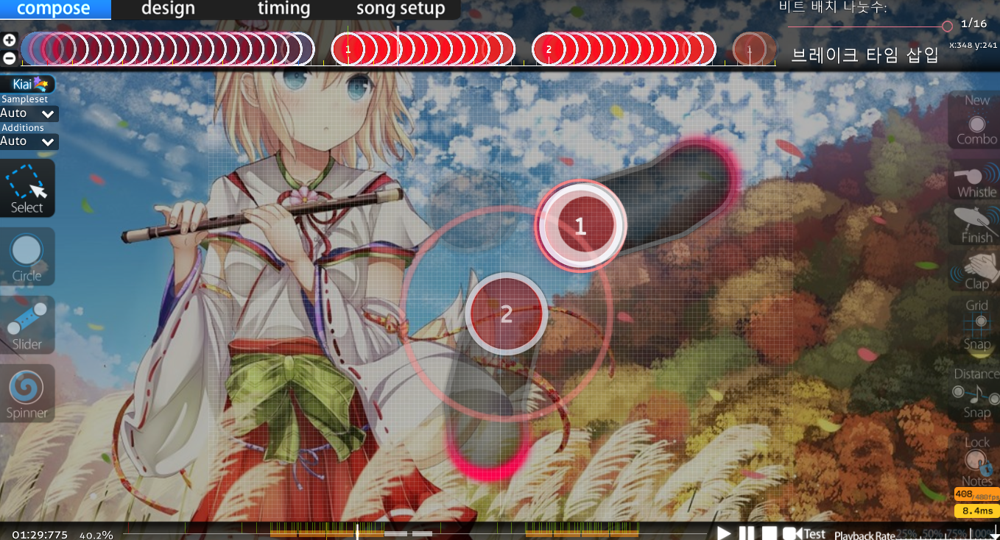
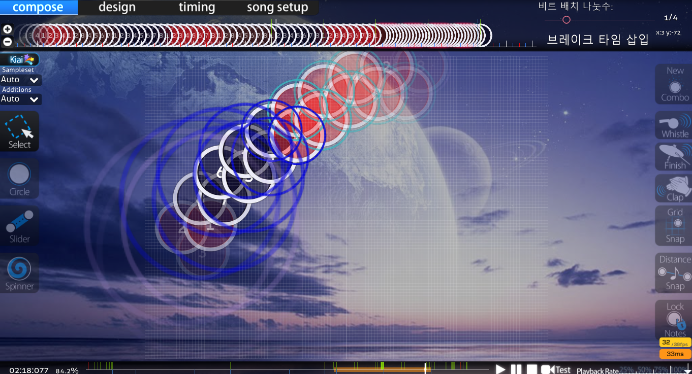

# Osu! Aim Analyzer

This is a program to inspect replays and diagnose player's aim.

## Appreciation
This program includes the whole source file of [Awlexus](https://github.com/Awlexus)'s [python-osu-parser](https://github.com/Awlexus/python-osu-parser), located on *osuparse* folder under *core* folder.

The idea of *rotatedness* and the concept of applying this to offset tablet range is heaviliy affected by [Mirei Hayasaka](https://osu.ppy.sh/users/5247450), the source is [here (Korean)](https://osu.ppy.sh/users/5247450).

## Download
Check the *Release* page!

If you click the version, *AimAnalyzer.zip* file will be there. Download and unzip it, and open *AimAnalyzer.exe* inside it. It might take few seconds to start.

## How To Use
If you open the AimAnalyzer.exe, you will look this window:

There is *Songs Folder* section. If you put songs folder there and load it, this tool can find the maps from the given replays. Make sure to input the correct osu! Songs folder, and then click *Load* button to use this feature.

To inspect replays, input a replay file(.osr) you want to inspect by the *Browse...* button on Replays tab, and input the corresponding map file on Maps tab. If you loaded songs folder on the above section, and left a map file blank, then this tool will try to find the map corresponding to the given replay automatically. Make sure to click *Include* checkbox on the left side to include that replay in analyzing.

Finally, click the *Load* button on the right side.

When the replay is loaded, the program will show you the following window.


Basically, **green** background means that this result is significant statistically. Conversely, **red** background means that this result is statistically unsignificant, so you may want to ignore that line of the result.

### Raw tab
Raw tab shows if the replay is parsed well. Before you check the results, it is **recommended to check this tab first** to see if the replay is parsed well.

The contents of this tab is written on the following format:
```
Time [timing] - Object: ([x], [y]) Pressed: ([p_x], [p_y]) @ [clicked_time]
```
* *timing*: the timing of the object
* *x*, *y*: the x and y coordinates of the object
* *p_x*, *p_y*: the x and y coordinates of where the player clicked the object
* *clicked_time*: the timing the player clicked the object

If the object is not pressed, or at least not attepted to be pressed, then *Not Pressed* must be written on the *Pressed* part. So you can **check if the replay is parsed well** by checking **if there are too many *Not Pressed* phrases exist**.

### Wideness tab

On *Wideness* tab, there are two parts of the result, *Skewedness* and *Wideness*.

Skewedness part shows you **How much your aim is skewed**. To say more specifically, it shows you that **for the circle placed at the center of the playfield**(i.e., (256, 192))**, where you hit that circle.** The cartoon shown below might help you understand it.


Wideness part shows you **How much you overaim/underaim** on average. In other words, it shows **How much your tablet range** (or just aim range for mouse palyers) **is wide or narrow** on average.


Raw Result part just shows the raw result of *statsmodels* fitting a linear regression model.

There is a graph on the leftside showing these results visually. The **pink** rectangle shows the original playfield, and the **blue** rectangle shows your average playfield compared to the original playfield. The **x-shaped marker** on the graph means that you are expected to hit objects on this location perfectly (i.e., errors are expected to be zero) on average. If the place for marker is located far away from the playfield, then it might not be shown.


### Rotatedness tab


Rotatedness tab shows you **how much your aim is rotated** on average.


Similar to the *Wideness* tab, the **pink** rectangle shows the original playfield, and the **blue** rectangle shows your average playfield compared to the original playfield. The black dot is the center of the playfield.

### settings.json
```
{
  "songsFolder": "C:\\Program Files (x86)\\osu!\\Songs",
  "replaysFolder": "C:\\Program Files (x86)\\osu!\\Replays"
}
```
Note: backslashes must be written twice (like the above example).
* songsFolder: default songs folder path. This will be written here:


* replaysFolder: default replays folder path. This will be used here:


## (Possible) Application for Diagnosis of Players' Tablet Range
0. Check *Raw* tab first, to see if the parsing process is done successfully.

1. To diagnose your tablet range, Basically think of moving *pink* rectangle to the fixed *blue* rectangle. There is a simple cheatsheet:

|If this tool says...|Then try this|
|---|---|
|Skewed leftward|Move your range left|
|Skewed rightward|Move your range right|
|Skewed upward|Move your range upward|
|Skewed downward|Move your range downward|
|Horizontally overaim|Increase the width of your range|
|Horizontally underaim|Decrease the width of your range|
|Vertically overaim|Increase the height of your range|
|Vertically underaim|Decrease the height of your range|
|Rotated clockwise|Rotate your range clockwise|
|Rotated anticlockwise|Rotate your range anticlockwise|

Of course, if the result is in *red* color, you may ignore the result; if it is in *green* color, you may want to take the result.

Note that it is recommended to offset *skewedness* first, but in my opinion (it's just really an opinion indeed), skewedness is not so important factor, so you may ignore it.
Furthermore, it is recommended to analyze multiple replays before you change your range (though it's up to you).

## Bits of not important theoretical background

### What osu! objects does this program inspect?
This program inspect only **circles which have enough distance with the previous object**. This is because:
* Inspecting spinners to check one's aim has no point!
* Regarding sliders, there are cases that player *intentionally* click the non-center place of an object. For example:
    * hitting those super fast sliders in [Ocelot - KAEDE [EX EX]](https://osu.ppy.sh/beatmapsets/660630#osu/1398809).
        
* Regarding not well-distanced circles, they are doubted to be a part of a stream. For a stream, there are also cases that player *intentionally* click the non-center place of an object. For example:
    * hitting this stream in [xi - Ascension to Heaven [Death]](https://osu.ppy.sh/beatmapsets/34348#osu/111680).
        

Of course, there are also cases that players hit non-center place of a circle, but I believe that these heuristics work fine.

### What click events does this program inspect?
As you know, not all misaims are due to the inaccuracy of your aim; it might be the result of misreading, hardware problems, or something else.
But to enhance the accuracy of analyzing, we may want to consider only misaims due to the inaccuracy of aiming.
To solve this problem, this program introduced a simple heuristic:
- Only click events near the objects (actually <code>2 x CS of a map</code>) are accounted.

This heuristic is expected to prevent some bone-head misses from being analyzed.

### Possible inaccuracy
I did not implemented stack leniency because streams are not regarded in this program. But there can be slight inaccuracy due to this point. 
I may implement it someday, then I will remove this paragraph.

## Feedback & Bug Reports
Feedback and bug reports are welcomed via any means. You can use issue tab of this repo, or directly contact to me via osu! PM or my discord(username: repo2x).
